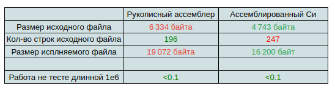

# Второе домашнее задание по архитектуре вычислительных систем
## Фирсов Федор БПИ219 Вариант 12

Разработать программу, определяющую минимальный и максимальный (по числовому значению) символ в заданной
ASCII-строке.

### Решение.
#### Я надеюсь что ничего не упустил и это работа на 9)
Я написал три кода на языке Си с консольным, файловым вводом/выводом и случайной генерацией. Решения в файлах [console.c](console.c), [random.c](random.c) и [files.c](files.c).

Я написал три кода на ассемблере с консольным, файловым вводом/выводом и случайной генерацией. Решения в файлах [gas_console.s](gas_console.s), [gas_random.s](gas_random.s) и [gas_files.s](gas_files.s).

А также [скрипт для сборки](build.sh)  и [скрипт для тестирования](full_test.sh)

### Тестирование
Чтобы собрать решения я написал [скрипт](build.sh) запуск которого собирает все 3 файла написанные на Си.

При запуске консольного решения необходимо ввести тольок строку и завершить ее вводом конца строки.

При запуске решения с случайной генерацией ничего вводить не нужно.

Для удобства тестирования я сделал работу с файлами в таком формате: Вы указываете программе и вхлдные и ожидаемые выходные данные, а программа находит свой ответ и сверяет его с результатом. Если Вы не знаете ответ на запрос, то можно указать в файле какой-то мусор, а программа найдет правильный ответ.

При запуске решения c файловым вводом выводом необходимо указать путь к [файлу ввода](test/test1.in) и [файлу для ответа(test/test1.out)  как 2 аргумента командной строки.

### Сравнения и производительность

К сожалению моя задача не располагает к тому, чтобы сравнивать решения по скорости и памяти, ведь все решения линейны по времени и памяти и проходят массив ровно 1 раз. В результате время подключения библиотеки влияет на ответ существенее, чем вариянты реализации. Наверное это происходит от того, что я даже не меня. переменные ведь букв достаточно мало, а значит и минимум обновиться маленькое число раз, даже если кажлая успеет побыть минимумом на префиксе.
Такимиобразом ничего не остаеся кроме как сравнить код по размеру)

